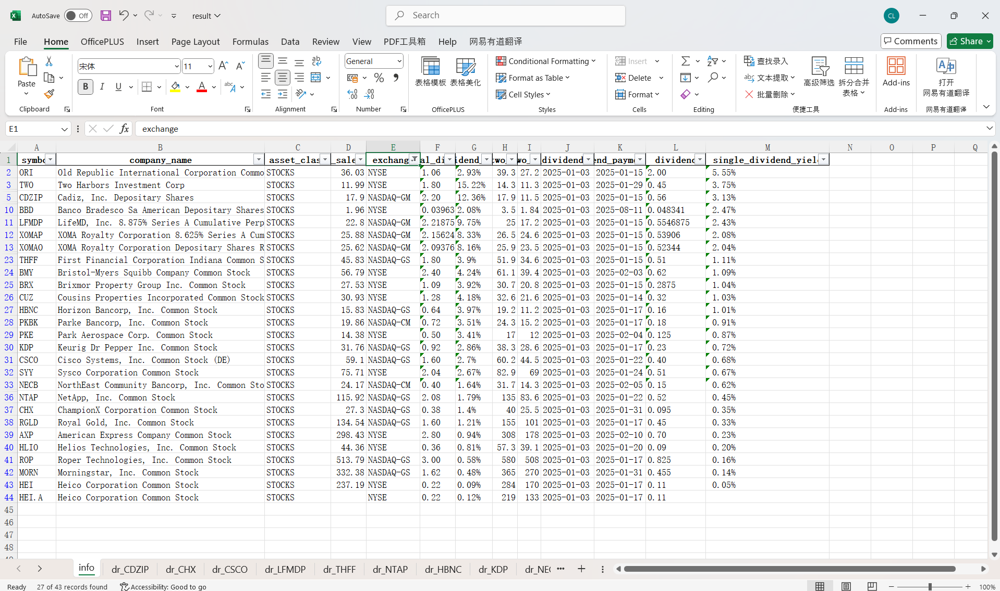

# dividend capture helper

This is a simple tool to help with your dividend capture strategy.

The tool will calculate the `amount / last sale price`(I will call it `single_dividend_yield` in this document)

For example, for ex-dividend date 2024-12-12, [ULTY](https://www.nasdaq.com/market-activity/etf/ulty/dividend-history),
the amount is $0.7092, and the last sale price is $9.34 when we run this tool. The `single_dividend_yield` is 0.7092 / 9.34 = 7.59%.
So if you can buy this stock before the ex-dividend date and sell it in the ex-dividend date with the same price, you can get 7.59% profit.

But dividend capture is not that simple, you should know that the stock price will drop for the ex-dividend day and 
always more than the dividend amount, so you should learn more about it before you use this tool. It's not a strategy 
which can make you always win. But it is a profitable strategy if you use it correctly.

## How to use

install the dependencies

```shell
pip install -r requirements.txt
```

Then run the main.py file, and you will get the result in the `/data/result.xlsx` file.

```shell
python main.py
```

By default, the output is the dividend information for the ex-dividend date of tomorrow. You can change it in the `main.py` file.


After the result is generated, open the `/data/result.xlsx` file, you will see the result like this:


You may realize that there are many empty cells. Most of those empty cells are N/A values in nasdaq.com.

sheet `info` is the information of each stock/etfs, and the others sheets start with `dr` are the dividend records for each stock/etfs.
You should sort them by the `single_dividend_yield` column to find out the most profitable stock/etfs. By the way, you can use filter to
ignore those stocks/etfs which exchange is Other OTC. Which means that you can't buy them in the Robinhood or other service provider.


This is the data for ex-dividend date: 2025-01-03. And the best choice is ORI.

# How to contribute

Just fork this repo and create a pull request. I will review it as soon as possible.
Pr, issues, and stars are welcome🥰.